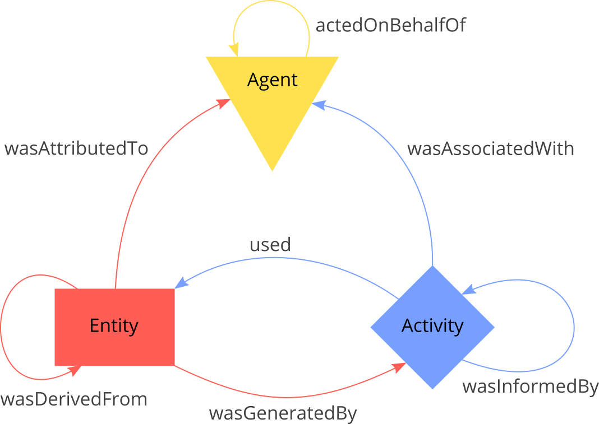
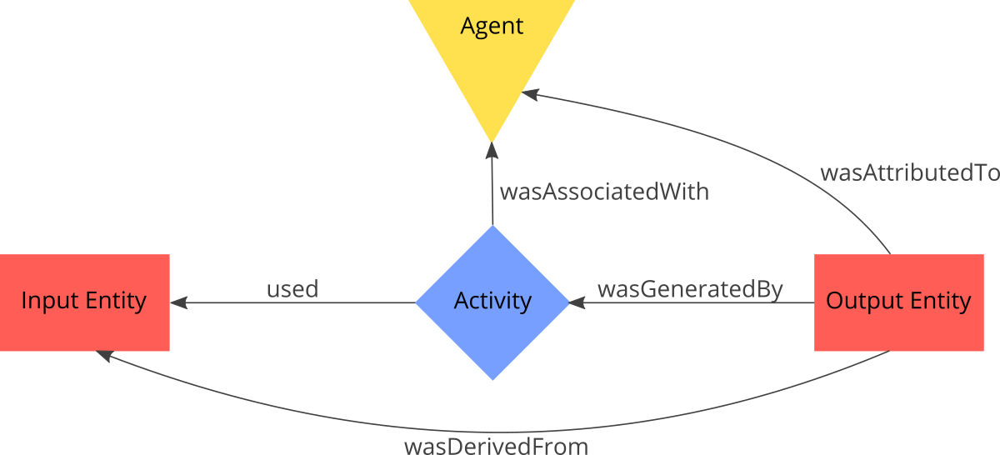
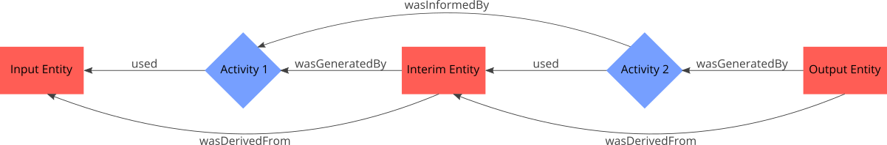
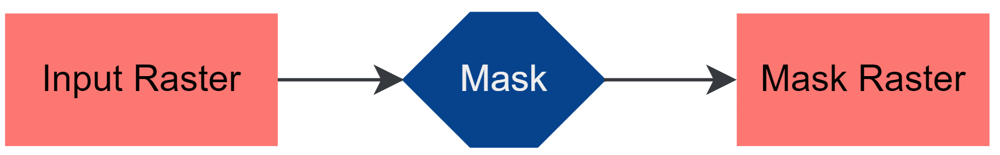
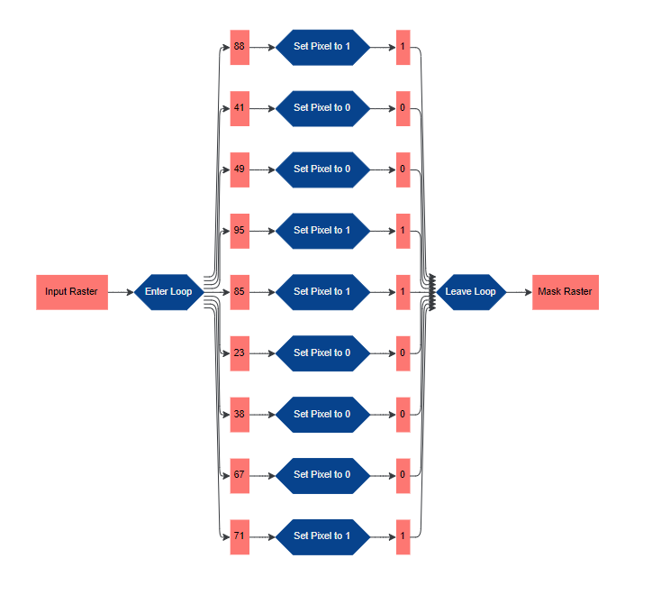

# provr - A user focused provenance tracking package that uses the PROV-Ontology

This package shall provide R script developers with some useful utilities to track meaningful provenance with inline R-code.

Find the Python version of this package at <https://github.com/GeoinformationSystems/provo>.

I wrote this package because concurrent provenance tracking packages tend to, either produce lengthy documents with loads of abundant information (typically automatic provenance tracing) or don't allow for fine grained tracking (e.g. using qualified comments to track provenance cannot interpret conditions or loops). To sum up: This package gives the sole control over what is tracked to the user, while simplifying the task as much as possible.

## Some words to the PROV-Ontology

This package produces provenance graphs that adhere to the PROV-Ontology <https://www.w3.org/TR/prov-o/>. Currently the package only implements the "starting point terms" (<https://www.w3.org/TR/2013/REC-prov-o-20130430/#cross-reference-starting-point-terms>) of the PROV-Ontology. These starting point terms are built by the three classes _Entity_, _Activity_ and _Agent_, as well as a set of allowed relations between those classes (see Fig. 1).

<figure align="center">

  <figcaption>Fig. 1 - Starting Point Terms of PROV-O (time related relations excluded). Notice the direction of the relations.</figcaption>
</figure>
<br></br>

In terms of data processing _Entities_ can be viewed as data and _Activities_ as processes that use existing data and generate new data. _Agents_ stand for persons, organizations or even software that carries out these processing steps. An example where a process uses some input data to produce some output data is shown in Fig. 2.

<figure align = "center">

  <figcaption>Fig. 2 - PROV-O description of a process that uses some input data and produces some output data, controlled by some agent.</figcaption>
</figure>
<br></br>

A provenance graph is generated by concatenating multiple activities and entities, e.g Fig. 3.

<figure align = "center">

  <figcaption>Fig. 3 - Simple PROV-O provenance graph without agents.</figcaption>
</figure>
<br></br>

## Using the package

As first step that graph has to be set up:

<p align = "center">Listing 1</p>
```R
init_provenance_graph(namespace = "https://www.yournamespace.com/script#")
```

PROV-O is RDF based, which means that every _Entity_, _Activity_ and _Agent_ has to have a unique ID that resolves to a URL-like structure called IRI. Every ID that you give to an _Entity_, _Activity_ or _Agent_ is concatenated to that very namespace you defined on graph initialization to build the IRI.

The package implements the three PROV-O Node types _Entity_, _Activity_ and _Agent_ as R-environments with class like behavior. Each Node type must have an ID and can have a label and a description. If no label is given on instantiation the id is also used as label.

### Example 1

E.g. creating an _Entity_ with the ID 'input_raster', the label 'Input Raster' and the description 'A 10 x 10 raster with values ranging from 0 to 100' would look like this:

<p align = "center">Listing 2</p>
```R
in_raster_entity <- Entity(
    id = "input_raster",
    label = "Input Raster",
    description = "A 10 x 10 raster with values ranging from 0 to 100" 
)
```

Now lets assume we have a script in which a 10 x 10 input raster with values ranging from 0 to 100 shall be converted to a masking raster by applying a threshold operation that sets values above 70 to 1 and other values to 0. The resulting mask raster shall be written in a new raster. 

<p align = "center">Listing 3</p>

```R
in_raster <- array(val <- sample(0:100), dim = c(10, 10))

out_raster <- array(NA, dim = c(10, 10))

for (i in seq_along(in_raster)) {
    if (in_raster[i] >= 70) {
        out_raster[i] <- 1
    } else {
        out_raster[i] <- 0
    }
}
```

To track the provenance of this example we can adjust the script to:

<p align = "center">Listing 4</p>

```R
library("provr")

init_provenance_graph(namespace = "https://www.provr.com/10x10raster_ex#")

in_raster <- array(val <- sample(0:100), dim = c(10, 10))
# build input entity
in_raster_entity <- Entity("in_raster", "Input Raster")

out_raster <- array(NA, dim = c(10, 10))
# build output entity
out_raster_entity <- Entity("out_raster", "Mask Raster")

for (i in seq_along(in_raster)) {
    if (in_raster[i] >= 70) {
        out_raster[i] <- 1
    } else {
        out_raster[i] <- 0
    }
}
# build mask activity
mask_activity <- Activity("mask", "Mask", "Generate mask by setting
    every value in the input raster that is 70 or greater
    to 1 and each other value to 0.")

# set inputs for mask activity
mask_activity$used(in_raster_entity)

# set the activity that generated the output entity
out_raster_entity$wasGeneratedBy(mask_activity)

# write graph to file
serialize_provenance_graph(name = "10x10raster_ex.ttl")
```

Visualized with the PROV-Viewer application (<https://github.com/GeoinformationSystems/ProvViewer>) you get Fig. 4.

<figure align = "center">

  <figcaption >Fig. 4 - Visualization of Listing 4. (Notice that ProvViewer shows the PROV-O properties wasUsedBy and generated, instead of used and wasGeneratedBy; i.e. the arrows point in the opposite direction.)</figcaption>
</figure>
<br></br>

The resulting RDF Graph File in Turtle `10x10raster_ex.ttl` looks as follows:

<p align = "center">Listing 5</p>

```TTL
@prefix rdf: <http://www.w3.org/1999/02/22-rdf-syntax-ns#> .
@prefix rdfs: <http://www.w3.org/2000/01/rdf-schema#> .
@prefix prov: <http://www.w3.org/ns/prov#> .
@prefix rscript: <https://www.provr.com/10x10raster_ex#> .

rscript:in_raster
    a prov:Entity ;
    rdfs:label "Input Raster" .

rscript:mask
    a prov:Activity ;
    rdfs:comment """Generate mask by setting
    every value in the input raster that is 70 or greater
    to 1 and each other value to 0.""" ;
    rdfs:label "Mask" ;
    prov:used rscript:in_raster .

rscript:out_raster
    a prov:Entity ;
    rdfs:label "Mask Raster" ;
    prov:wasGeneratedBy rscript:mask .
```

### Example 2

What we just did, was tracking provenance at a coarse grained level, i.e. so that the resulting graph mainly conveys the meaning of the processing steps. But there are also cases where users might want to track provenance at a fine grained level. In the case of our example that would mean tracking the provenance pixel-wise. That requires us to set up an entity for each pixel of both the input and the output raster. We also define two 'classes' of activities: 'set_to_1' and 'set_to_0'. On each iteration of our loop we set up an 'instance' of either the one or the other. What I mean by 'classes' and 'instances' is that each activity gets a unique ID, but we only give two different labels. For this example we reduce the raster size to 3x3. We furthermore define two more (more or less arbitrary) activities called 'enter_loop' and 'leave_loop' to foster understandability of the resulting graph.

<p align = "center">Listing 6</p>

```R
library("provr")
library("uuid")

init_provenance_graph(namespace = "https://www.provr.com/10x10raster_ex#")

in_raster <- array(val <- sample(0:100), dim = c(3, 3))
in_raster_entity <- Entity("in_raster", "Input Raster")

out_raster <- array(NA, dim = c(3, 3))
out_raster_entity <- Entity("out_raster", "Mask Raster")

enter_loop_activity <- Activity("enter_loop", "Enter Loop")
enter_loop_activity$used(in_raster_entity)

leave_loop_activity <- Activity("leave_loop", "Leave Loop")

for (i in seq_along(in_raster)) {
    # build input px entity
    id <- paste("in_px", toString(i), sep = "_")
    label <- toString(in_raster[i])
    in_px_entity <- Entity(id, label)
    in_px_entity$wasGeneratedBy(enter_loop_activity)

    out_px_entity <- NA
    if (in_raster[i] >= 70) {
        out_raster[i] <- 1

        # build set to 1 activity
        id <- paste("set_to_one", UUIDgenerate(), sep = "_")
        set_to_one_activity <- Activity(id, "Set Pixel to 1")
        set_to_one_activity$used(in_px_entity)

        # build output px entity
        id <- paste("out_px", toString(i), sep = "_")
        out_px_entity <- Entity(id, "1")
        out_px_entity$wasGeneratedBy(set_to_one_activity)
    } else {
        out_raster[i] <- 0

        # build set to 0 activity
        id <- paste("set_to_zero", UUIDgenerate(), sep = "_")
        set_to_zero_activity <- Activity(id, "Set Pixel to 0")
        set_to_zero_activity$used(in_px_entity)

        # build output px entity
        id <- paste("out_px", toString(i), sep = "_")
        out_px_entity <- Entity(id, "0")
        out_px_entity$wasGeneratedBy(set_to_zero_activity)
    }
    leave_loop_activity$used(out_px_entity)
}
out_raster_entity$wasGeneratedBy(leave_loop_activity)


# write graph to file
serialize_provenance_graph(name = "10x10raster_ex_fine.ttl")
```

Fig. 5 shows the visualization of the resulting provenance graph. 

<figure align = "center">

  <figcaption>Fig. 5 - Visualization of Listing 6</figcaption>
</figure>
<br></br>

## Wrapping up

The package enables script developers to build concise provenance graphs that fits their needs. The obvious drawback to fully automated approaches, is the required typing to set up the nodes and relations. The fine-grained graph example showed that the user can automate the provenance generation to a certain degree. Control structures can be leveraged and values of variables can be used to build ids, labels and descriptions.

### Dos and Don'ts / Pitfalls

- When creating an _Entity_, _Activity_ or _Agent_, I advise to add the according `*_entity`, `*_activity` or `*_agent` to your variable name to prevent confusion
- The package prevents you from putting the wrong classes as argument to the methods of the classes:

    ```R
    agent <- Agent("agent")
    entity <- Entity("entity")
    entity$wasGeneratedBy(agent)

    > Error in entity$wasGeneratedBy(agent) : 
        argument has to be of the class "Activity"!
    ```

- the package does NOT prevent you from assigning the same ID to different nodes
    - best case, accidentally setting up a node twice:

        ```R
        entity <- Entity(id = "some_entity", label = "descriptive name")
        # ...
        entity <- Entity(id = "some_entity", label = "very descriptive name")
        ```

        This results in an Entity that has two labels (resulting RDF):

        ```
        rscript:some_entity
            a prov:Entity ;
            rdfs:label "descriptive name", 
                "very descriptive name" .
        ```
    
    - worst case: same ID for nodes that should be different. This results in a meaningless provenance graph.

- t.b.c.

## TODO

- [ ] Add graph loading capabilities
- [ ] add time tracking for activities
- [ ] add automatic id generation toggle
- [ ] implement full PROV-O

## Used Packages

- rdflib (<https://cran.r-project.org/web/packages/rdflib/index.html>)
- uuid (<https://cran.r-project.org/web/packages/uuid/index.html>)
- magrittr (<https://cran.r-project.org/web/packages/magrittr/index.html>)

## License

GNU General Public License 3

<https://www.gnu.org/licenses/gpl-3.0.de.html>

## Contact

Arne Rümmler (<arne.ruemmler@tu-dresden.de>)
